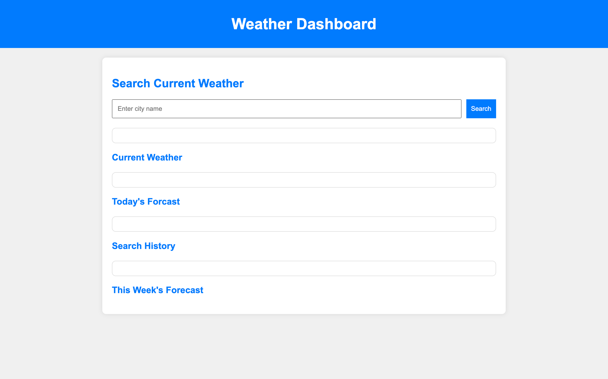

# Module-06 Server-Side APIs: Weather Dashboard

## Description
Using new skillsets to create a weather dashboard to plan a trip accordingly.

## Acceptance Criteria
- When I on the weather dashboard it form inputs
- I can search for a city
- I am presented with current and future conditions for that city
- This then can be added to the search history
- I can view current weather conditions for that city
- I am presented with the city name, the date, an icon representation of weather conditions, the temperature, the humidity, and the the wind speed
- I can view future weather conditions for that city
- I am presented with a 5-day forecast that displays the date, an icon representation of weather conditions, the temperature, the wind speed, and the humidity
- I can click on a city in the search history
- I am again presented with current and future conditions for that city

## Screenshot of dashboard

## Link to Deployed Attributes
https://hjenp22.github.io/CodingChallenger/
 
## About the Author
- Email: hjipark22@gmail.com
- Github: hjenp2